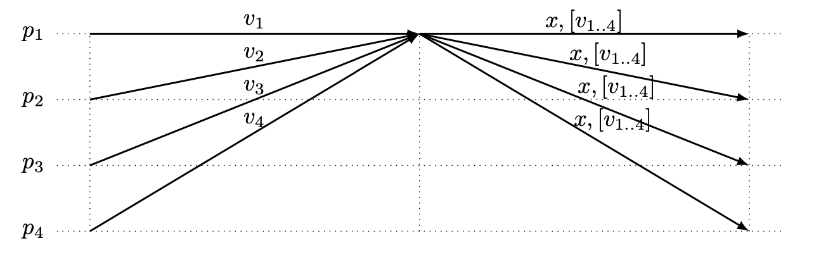
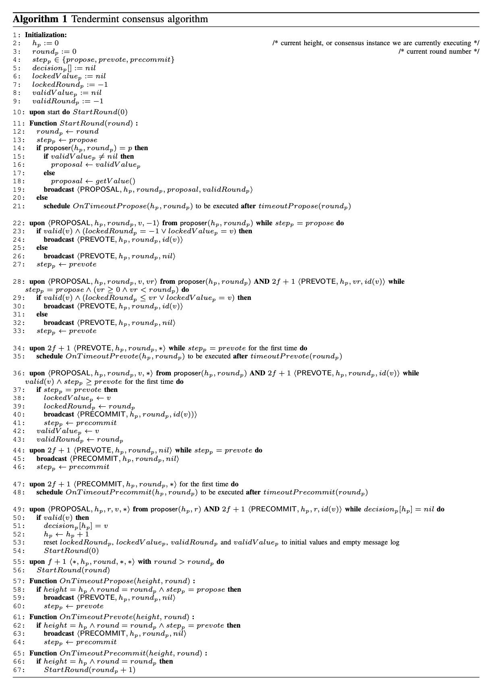

# The latest gossip on BFT consensus
[原文链接](https://arxiv.org/pdf/1807.04938.pdf)
## 摘要
本文介绍了 Tendermint，这是一种用于在对抗条件下对分布式网络中的事件进行排序的新协议。该问题通常被称为拜占庭容错（BFT）共识或原子广播，由于基于区块链的数字货币（例如比特币和以太坊）的广泛成功，该问题近年来引起了广泛关注，并在公共场合成功解决了该问题没有中央权威机构的情况。Tendermint 通过依赖节点之间的点对点gossip协议，使该主题的经典学术工作现代化，并简化 BFT 算法的设计。

## I. 介绍
共识是分布式计算中最基本的问题之一。这很重要，因为它在状态机副本 (SMR) 中的作用，这是一种复制服务的通用方法，可以建模为确定性状态机[[1]]( https://lamport.azurewebsites.net/pubs/time-clocks.pdf )、[[2]]( https://dl.acm.org/doi/pdf/10.1145/98163.98167 )。这种方法的关键思想是服务副本以相同的初始状态开始，然后以相同的顺序执行请求（也称为事务）；从而保证副本彼此保持同步。SMR 方法中共识的作用是确保所有副本以相同的顺序接收事务。传统上，基于 SMR 的系统部署在数据中心设置（局域网）中，具有少量副本（三到七个），并且通常是单个管理域的一部分（例如 Chubby [[3]]( https://static.googleusercontent.com/media/research.google.com/zh-CN//archive/chubby-osdi06.pdf )）；因此它们仅处理良性（崩溃）故障，因为更一般的故障形式（特别是恶意或拜占庭故障）被认为仅以可忽略的概率发生。  

近年来加密货币或区块链系统的成功（例如，[[4]]( https://bitcoin.org/bitcoin.pdf )、[[5]]( https://github.com/ethereum/wiki/wiki/White-Paper )）对基于 SMR 的系统的设计和部署提出了一系列全新的挑战：在大量节点之间通过广域网达成一致（数百或数千个）不属于同一管理域的节点，并且其中一部分节点可能进行恶意行为（拜占庭故障）。此外，与之前节点之间完全连接的数据中心部署相反，在区块链系统中，节点仅连接到其他节点的子集，因此通过基于 gossip 的对等协议实现通信。新的需求要求设计和算法不一定存在于拜占庭容错共识（或 SMR）系统（例如，[[6]]( https://groups.csail.mit.edu/tds/papers/Lynch/jacm88.pdf )、[[7]]( https://pmg.csail.mit.edu/papers/bft-tocs.pdf )）的经典学术文献中，因为主要关注的是不同的设置。  

在本文中，我们描述了一种新的拜占庭容错共识算法，它是称为 [Tendermint](https://github.com/tendermint/tendermint) 的 BFT SMR 平台的核心。Tendermint 平台包括一个用 Go 编写的高性能 BFT SMR 实现、一个用于在共识之上构建任意确定性应用程序的灵活接口，以及一套用于部署和管理的工具。

Tendermint 共识算法的灵感来自 PBFT SMR 算法 [[8]]( https://www.usenix.org/legacy/events/osdi99/full_papers/banga/banga.pdf?ref=https://githubhelp.com ) 和用于验证故障的 DLS 算法（来自 [[6]]( https://groups.csail.mit.edu/tds/papers/Lynch/jacm88.pdf ) 的算法 2）。与 DLS 算法类似，Tendermint 在第 2 轮中进行，其中每一轮都有一个专门的提议者（也称为协调者或领导者），并且作为正常处理的一部分，一个进程会进入新一轮（不仅是在提议者有缺陷或被怀疑为PBFT 中的足够多的进程出错）。每一轮的通信模式与 PBFT 的“正常”情况非常相似。因此，在优选的条件下（正确的提议者，正确的进程之间及时可靠的通信），Tendermint 决定分三个通信步骤（与 PBFT 相同）。  

Tendermint 共识算法的主要创新和贡献是一种新的终止机制。如 [[9]]( https://infoscience.epfl.ch/record/158894/files/WIC.pdf )、[[10]](https://infoscience.epfl.ch/record/146821/files/bcc-paper.pdf) 中所述，用于部分同步系统模型（例如 PBFT  [[8]]( https://www.usenix.org/legacy/events/osdi99/full_papers/banga/banga.pdf?ref=https://githubhelp.com ) 、[[6]]( https://groups.csail.mit.edu/tds/papers/Lynch/jacm88.pdf )、[[11]]( https://www.cs.cornell.edu/lorenzo/papers/Martin06Fast.pdf )）的现有 BFT 共识（和 SMR）算法通常依赖于图 1 为终止。图 1 说明了在进程开始新一轮时提议者更改期间交换的消息。它保证最终（即在某个全球稳定时间，GST 之后），存在一个具有正确提议者的轮次，这将使系统进入单一配置。直观地说，在提议的值被所有正确进程接受并且正确进程之间的通信及时可靠的一轮中，所有正确进程决定。

**图 1：提议者（协调者）变更：p1 是新的提议者。**

为了确保提议的值被所有正确的进程接受，提议者将 
- 通过接收来自其他进程的消息来构建全局状态，
- 选择要提议的安全值，以及 
- 将选定的值与接收到的签名消息一起发送支持它的第一步。  

正确流程发送给下一个提议者的值  通常对应于流程认为可以接受决策的值：
- 在 PBFT [[8]]( https://www.usenix.org/legacy/events/osdi99/full_papers/banga/banga.pdf?ref=https://githubhelp.com ) 和 DLS [[6]]( https://groups.csail.mit.edu/tds/papers/Lynch/jacm88.pdf ) 中，它不是值本身，而是一组   个具有相同值的  的签名消息
- 在 Fast Byzantine Paxos [[11]]( https://www.cs.cornell.edu/lorenzo/papers/Martin06Fast.pdf ) 中，值本身正在被发送。

在这两种情况下，在我们的系统模型中使用这种机制（即基于 *gossip* 的网络上的大量节点）将具有很高的通信复杂性，并且会随着进程数量的增加而增加：在第一种情况下，因为发送的消息取决于进程，在第二种情况下，作为值（事务区块）由每个进程发送。第一步中收到的消息集通常搭载在提议消息上（在 图 1 中用  表示），以证明所选值  的选择是正确的。请注意，发送此消息的数量也不会随系统中的进程数量而变化。

我们为 Tendermint 设计了一种新颖的终止机制，它更适合我们考虑的系统模型。它不需要额外的通信（即不需要发送新消息，也不需要在现有消息上捎带信息），它完全基于与 PBFT [[8]]( https://www.usenix.org/legacy/events/osdi99/full_papers/banga/banga.pdf?ref=https://githubhelp.com ) 中的正常情况非常相似的通信模式。因此，在 Tendermint 中只有一种执行模式，即正常模式和恢复模式之间没有分离，这在其他类似 PBFT 的协议中也是如此（例如，[[8]]( https://www.usenix.org/legacy/events/osdi99/full_papers/banga/banga.pdf?ref=https://githubhelp.com )、[[12]]( https://www.di.fc.ul.pt/~bessani/publications/srds09-spinning.pdf ) 或 [[13]]( https://www.usenix.org/legacy/event/nsdi09/tech/full_papers/clement/clement.pdf )）。我们相信这使 Tendermint 更易于理解和正确实施。  

请注意，降低消息复杂性以提高 BFT 共识算法的可扩展性和分散性（进程数量）的正交方法是使用高级密码学（例如 Boneh-Lynn-Shacham (BLS) 签名 [[14]]( https://www.iacr.org/archive/asiacrypt2001/22480516.pdf )），例如在SBFT [[15]]( https://arxiv.org/pdf/1804.01626.pdf )。

## II. 定义
### A. 模型
我们考虑一个通过交换消息进行通信的进程系统。进程可以是正确的，也可以是错误的，其中一个错误的进程可以以任意方式运行，即我们认为是拜占庭错误。我们假设每个进程都有一定的投票权（进程的投票权可以为 0）。我们模型中的流程不是单个管理域的一部分；因此，我们不能强制所有进程之间的直接网络连接。相反，我们假设每个进程都连接到称为对等点的进程子集，这样所有正确的进程之间都存在间接通信通道。进程之间的通信是使用 *gossip* 协议 [[16]]( http://bitsavers.trailing-edge.com/pdf/xerox/parc/techReports/CSL-89-1_Epidemic_Algorithms_for_Replicated_Database_Maintenance.pdf ) 建立的。

形式上，我们使用部分同步系统模型 [[6]]( https://groups.csail.mit.edu/tds/papers/Lynch/jacm88.pdf ) 的变体对网络通信进行建模：在系统的所有执行中，都有一个界限 和一个即时 （全局稳定时间），因此 GST 之后正确进程之间的所有通信都是可靠且  及时，即如果正确的进程  在时间  向正确的进程   发送消息  ，则   将在  之前收到  。除了标准的部分同步系统模型 [[6]]( https://groups.csail.mit.edu/tds/papers/Lynch/jacm88.pdf ) 之外，我们还假设了一个辅助属性来捕捉基于*gossip*的通信性质：

*gossip*通信：如果一个正确的进程   在时间   发送了一些消息  ，那么所有正确的进程都会在   之前收到  。此外，如果一个正确的进程   在时间   收到一些消息  ，那么所有正确的进程将在   之前收到  。

边界   和   是系统参数，为了我们算法的安全性，不需要知道其值。在   之后的有限时间内保证算法的终止。在实践中，该算法将在模型的稍弱变体中正常工作，其中系统在（足够长的）好时期（对应于系统可靠和   及时的   之后的时期）和坏时期（对应于  之前的时期，在此期间系统是异步的并且消息可能会丢失），但考虑  模型可以简化讨论。

我们假设处理步骤（可能包括发送和接收消息）花费零时间。进程配备了时钟，因此它们可以测量本地超时。由于使用了公钥加密技术，因此假设欺骗/冒充攻击在任何时候都是不可能的，即我们假设所有协议消息都包含数字签名。因此，当正确的进程  从其对等方接收到签名消息  时，进程  可以验证谁是消息  的原始发送者以及消息签名是否有效。我们没有在算法的伪代码中明确说明签名验证步骤以提高可读性；我们假设在该级别仅考虑具有有效签名的消息（并且丢弃具有无效签名的消息）。

### B. 状态机副本(SMR)
状态机复制 (SMR) 是一种复制服务的通用方法，被建模为确定性状态机 [[1]]( https://lamport.azurewebsites.net/pubs/time-clocks.pdf )、[[2]]( https://dl.acm.org/doi/pdf/10.1145/98163.98167 )。这种方法的关键思想是保证所有副本以相同的状态开始，然后以相同的顺序应用来自客户端的请求，从而保证副本的状态不会发散。在 Schneider [[2]]( https://dl.acm.org/doi/pdf/10.1145/98163.98167 ) 之后，我们注意到以下是实现状态机副本容忍（拜占庭）故障的关键：
- 副本协调。**所有 [非故障] 副本接收和处理相同的请求序列**。

此外，正如 Schneider 还指出的那样，该属性可以分解为两部分，***Agreement*** 和 ***Order***：***Agreement*** 要求所有（非故障）副本接收所有请求，而 ***Order*** 要求接收请求的顺序在所有副本中都相同。

拜占庭容错状态机副本需要确保一个额外的要求：仅执行客户端提出的请求（在 Tendermint 术语中称为事务）。在 Tendermint 中，交易验证是被副本服务的责任；在收到来自客户端的交易后，Tendermint 进程会询问服务请求是否有效，并且只会处理有效的请求。

### C. 共识
Tendermint 通过顺序执行共识实例来解决状态机复制，以就每个事务块达成一致，然后由被复制的服务执行。我们考虑拜占庭共识问题的一个变体，称为基于有效性**断言**的拜占庭共识，它是由区块链系统驱动的 [[17]]( https://arxiv.org/pdf/1702.03068.pdf )。问题由***Agreement***、***Termination***和***Validity***定义。
- ***Agreement***：没有两个正确的过程决定不同的值。
- ***Termination***：所有正确的过程最终决定一个值。
- ***Validity***：确定的值是有效的，即它满足表示为  ) 的预定义**断言**

拜占庭共识问题的这个变体有一个特定于应用程序的  ) 谓词来指示一个值是否有效。例如，在区块链系统的上下文中，如果一个值不包含添加到区块链的最后一个值（区块）的适当散列，则它是无效的。

## III. TENDERMINT共识算法
在本节中，我们将介绍 Tendermint 拜占庭容错共识算法。该算法由算法 1 中的伪代码列表指定。我们将该算法表示为一组原子执行的规则。我们假设进程使用 gossip 协议交换协议消息，并且接收和发送的消息都存储在每个进程的本地消息日志中。一旦消息日志包含相应条件评估为真的消息，就会触发 ***upon*** 规则。假设接收到  个特定类型和内容的消息的条件表示接收的消息的发送者的总投票权至少等于 。例如，条件 > ) , 在接收到高度 、一轮  且值等于  ) 的  消息时评估为真，其发送者的总投票权至少等于 。一些规则以“第一次”结尾” 约束表示它仅在相应条件第一次评估为真时触发。这是因为这些规则并不总是改变算法变量的状态，所以没有这个约束，算法可以永远执行这些规则。具有索引  的变量是进程局部状态变量，而没有索引  的变量是值占位符。符号  表示任何值。
  
**算法 1 Tendermint共识算法**

我们用  表示系统中进程的总投票权，并假设系统中故障进程的总投票权以系统参数  为界。该算法假设 ，即它要求故障进程的总投票权小于总投票权的三分之一。为简单起见，我们给出了  的算法。

该算法分轮进行，每一轮都有一个专门的提议者。轮到提议者的映射对于所有进程都是已知的，并作为函数 )给出，返回共识实例h中一轮轮的提议者。我们假设提议者选择函数是加权循环法，其中过程与其投票权成比例地旋转。内部协议状态转换由消息接收和超时到期触发。算法 1 中存在三种超时：、 和 。超时防止算法阻塞并永远等待某些条件为真，确保进程在轮次之间不断转换，并保证最终（在  之后）正确进程之间的通信是及时和可靠的，因此它们可以做出决定。最后一个角色是通过增加每个新回合  的超时来实现的，即 =initTimeoutX+r*timeoutDelta ) ;每个新高度（共识实例）都会重置它们。

进程在 Tendermint 中交换以下消息：、 和 。当前轮的提议者使用  消息来建议一个潜在的决策值，而  和  是对提议值的投票。根据 [[10]](https://infoscience.epfl.ch/record/146821/files/bcc-paper.pdf) 中对共识算法的分类，Tendermint 与 PBFT [[7]]( https://pmg.csail.mit.edu/papers/bft-tocs.pdf ) 和 DLS [[6]]( https://groups.csail.mit.edu/tds/papers/Lynch/jacm88.pdf ) 一样属于第 3 类，因此需要两个投票步骤（总共三个通信交换）来决定一个值。 Tendermint 共识算法是为区块链上下文设计的，其中要决定的价值是一个交易块（即它可能非常大，由许多交易组成）。因此，在算法 1（类似于 [[7]]( https://pmg.csail.mit.edu/papers/bft-tocs.pdf )）中，我们明确发送一个值（交易块）和一个小的、恒定大小的值 （一个唯一的值标识符，通常是值的哈希值，即，如果=id(v') )，然后 )。  消息是唯一携带该值的消息；  和  消息携带值 。在某个回合  中，当收到针对  的提案和针对  ) 的  个投票权等价的  消息时，一个正确的流程会在 Tendermint 中决定值 。为了在第  轮中为  发送  消息，正确的进程等待在第  轮中接收相应的  消息的  和 。否则，它会发送带有特殊  值的  消息。这确保了正确的进程在一轮中只能  一个值（或 ）。由于提议者可能是错误的，提议的值被正确的进程视为建议（它不会被盲目接受），并且正确的进程通过发送  ) 的  消息来告诉其他人它是否接受了值  的提议；否则它会发送带有特殊  值的  消息。

每个进程在算法 1 中维护以下变量：、、、 和 。  表示内部 Tendermint 状态机的当前状态，即反映了本轮算法执行的阶段。锁定值存储已发送  消息的最新值（相对于整数）。  是进程发送不为零的  消息的最后一轮。我们还说，一个正确的进程通过在为  ) 发送  消息之前设置  和  来锁定一个值 。由于只有在收到  个针对  ) 的  消息时，正确的进程才能确定值 ，这意味着可能的决策值是由至少  等效于正确进程的投票权锁定的值。因此，在某个回合  中接收到  和  的相应  消息的任何值  都是可能的决策值。  变量的作用是存储最近可能的决策值；  是更新  的最后一轮。除了这些变量之外，进程还存储当前共识实例（，在 Tendermint 中称为高度）和当前轮数（）并将它们附加到每条消息。最后，一个进程还存储了一系列决策，（Tendermint 假设一系列共识实例，每个高度一个）。

每一轮都由一个提议者通过  消息建议一个值开始（见第 19 行）。在每个高度的初始轮次中，提议者可以自由选择要建议的值。在算法 1 中，正确的过程使用外部函数  ) 获得要提议的值，该函数返回要提议的有效值。在接下来的几轮中，只有当  时，一个正确的提议者才会建议一个新值；否则建议使用有效值（见第 15-18 行）。除了提议的值之外， 消息还包含  ，因此其他进程被告知有关提议者将  值作为可能的决策值的最后一轮。请注意，如果正确的提议者  在  中发送带有  的 ，这意味着进程  在该轮  中收到了  和相应的  个  消息。如果一个正确的进程在时间  发送了具有有效值 (  ) 的  消息，则根据 Gossip 通信属性，所有正确的进程将在时间  之前收到相应的  和  消息。因此，所有正确的过程都将能够验证建议值的正确性，因为它得到了  和相应的  投票权等价的  消息的支持。

如果外部有效函数对值  返回 *true*，并且  没有锁定任何值 (  ) 或  有锁定值  );见第 23 行。如果提议的对是 (  ) 并且正确的进程  锁定了某个值，如果它是更近的可能决策值、 或如果 （见第 29 行）。否则，正确的进程将通过发送带有  值的  消息来拒绝该提案。如果  过期（当正确的进程开始新一轮时触发）并且进程在当前轮中尚未发送  消息（参见第 57 行），正确的进程也会发送  值的  消息。

如果正确的进程接收到某个值  的  消息和  ) 的  个  消息，那么它会发送带有  ) 的  消息。否则，它发送值为  的 。一个正确的进程也会发送带有  值的  消息，以防  过期（当一个正确的进程发送  消息并收到任何  个  消息时启动）并且一个进程在当前轮中还没有发送  消息（参见第 65 行）。如果一个正确的进程在某个轮次中收到针对  的  的  消息和  个具有  ) 的  消息（参见第 51 行），则决定某个值 。为了防止算法阻塞并永远等待这个条件为真，算法 1 依赖于 。它在进程接收到当前轮次的任何一组  个  消息后触发。如果  重新提交到期并且进程尚未决定，则该进程开始下一轮（参见第 65 行）。当一个正确的进程  做出决定时，它会启动下一个共识实例（针对下一个高度）。 Gossip 通信属性确保导致  做出决定的  和  个  消息最终被所有正确的进程接收，因此它们也会做出决定。

### A. 终止机制
Tendermint 通过一种新颖的机制确保终止，该机制受益于基于 gossip 的通信性质（请参阅 Gossip 通信属性）。它需要管理两个额外的变量， 和 ，然后由提议者在提议步骤期间使用，如上所述。当进程在轮  中接收到值  的有效  消息和对应的  ) 的  个  消息时， 和  被轮  中的正确进程更新为  和 （参见第 36 行的规则）。

我们现在简要介绍一下管理和提议  和  如何确保终止。正式处理留至第四节。

首先要注意的是，在良好期间，由于 Gossip 通信属性，如果一个正确的进程  在某个轮  中锁定了一个值 ，那么所有正确的进程都会在  轮结束之前将  更新为  并将  更新为 （我们在第四节中正式证明了这一点）。直觉是，导致  在第  轮中锁定值  的消息将在第  轮结束之前被传递给所有正确的进程，因此它将更新  和 （第 36 行）。因此，如果一个正确的进程在良好期间锁定了某个值，则所有正确的进程都会更新  和 ，以便所有正确的进程都可以接受后续轮次中提出的值。请注意，在正常期间可能会发生这样的情况，没有正确的进程锁定一个值，但某些正确的进程  在某个回合中更新了  和 。由于在这种情况下没有正确的进程锁定一个值，所有正确的进程也可以接受  和 ，因为对于每个正确的进程 ， 并且因为 Gossip 通信属性确保  在该轮中收到的相应  消息  在  时间后被所有正确的进程接收。

最后，可能会发生在  之后，有一个很长的轮次序列，其中没有正确的进程既不会锁定值也不会更新  和 。在这种情况下，在这一系列轮次中，正确进程建议的建议值并未被所有正确进程接受。请注意，此轮次序列始终是有限的，因为在每一轮开始时，至少有一个正确的进程 ，因此每个正确的进程都可以接受  和 。这是正确的，因为存在一个正确的进程 ，使得对于每个其他正确的进程 ， 或 。这是正确的，因为  是在所有正确进程中的最近一轮中锁定了一个值的进程（或者没有正确的进程锁定任何值）。因此，最终  在某一轮中将是正确的，并且建议的值将被所有正确的进程接受，因此终止该轮序列。

因此，更新  和  变量，以及 Gossip 通信属性，共同确保最终，在良好时期，存在一个具有正确提议者的轮，其提议的值将被所有正确的进程和所有正确的进程接受将在该轮结束。请注意，该机制与图 1 中所示的通用终止机制相反，除了作为通常称为“正常”情况的一部分已发送的消息之外，不需要交换任何其他信息。

## IV. TENDERMINT 共识算法的证明
**引理 1.**   
对于所有 ，投票权至少等于   的任意两组进程至少有一个共同的正确进程。

证明：由于总投票权等于 ，我们有 =n+f+1 )。这意味着投票权等于  的两个集合的交集包含至少  个共同投票权，即至少有一个正确的进程（因为错误进程的总投票权为 ）。结果直接由此而来。

**引理 2.**  
如果  在轮  中正确处理锁定值  )，那么在所有轮  中，它们发送  ) 或  的 。

证明：我们通过对  的归纳来证明结果。

基本步骤  ：让我们用  表示投票权等于  的正确进程集。根据第 22 行和第 28 行的规则，来自集合  的进程不能接受任何值的  与第  轮中的  不同，因此不能发送 > ) 消息，如果 。因此，引理适用于基本步骤。

从  到  的归纳步骤：我们假设在第  轮之前，集合  中的任何进程都没有为不同于  ) 或  的值发送 。我们现在证明引理也适用于第  轮. 由于来自集合  的进程在  轮中发送  ) 或  的 ，根据引理 1，没有值  可以接收  个  消息第  ) 轮。因此，对于集合  中的所有进程， 并且。让我们通过一个矛盾假设，来自集合  的进程  在第  轮中为值  ) 发送 ，其中 。这只有在第 30 行才有可能。请注意，这意味着  收到  个 )> ) 消息，其中  和 （见第 29 行）。与  ) 和引理 1 的矛盾。

**引理 3.**   
算法 1 满足***Agreement***。

证明：设轮  是第一轮高度  使得某个正确的过程  决定 。我们现在证明如果某个正确的过程  在某轮  中决定 ，则 。

如果 ， 在第 49 行至少收到  个 > ) 消息，而  至少收到  个 > ) 消息。根据引理 1，两组投票权为  的消息在至少一个正确的过程中相交。由于一个正确的进程在一轮中发送单个  消息，则 。

我们通过反证法证明了  的情况。根据规则 49， 已收到至少  个投票权等价的 > ) 消息，即，至少  个投票权等价的正确进程已将值  锁定在轮  并发送了这些消息  )。让这组消息用  表示。另一方面， 至少收到了  个投票权，相当于 > ) 消息。由于所有故障进程的投票权最多为 ，因此某个正确的进程  发送了其中一条消息。根据第 36 行的规则，在发送 > ) 之前， 在第  轮中锁定了值 。因此， 在  轮中收到了  个  ) 的  消息（见第 36 行）。根据引理 1，来自集合  的进程已在第  轮中为  ) 发送了  消息。与  ) 和引理 2 的矛盾。

**引理 4.**   
算法 1 满足***Validity***

证明：简单地遵循第 50 行的规则，该规则确保只能确定有效值。

**引理 5.**   
如果我们假设：
- 一个正确的进程  是第一个在时间  时进入轮次  的正确进程（对于每个正确的进程 ，时间 ）
- 第  轮的提议者是一个正确的过程 
- 对于每个正确的进程 ， 在时间   
- >2\bigtriangleup+timeoutPrecommit(r-1) ), >2\bigtriangleup,timeoutPrecommit(r)>2\bigtriangleup )   

然后所有正确的进程在  ) 之前的第  轮中决定。

证明：由于   是第一个正确进入轮   的进程，它在  )  到期后执行第 67 行。因此，  在时间   之前的第   轮中收到了   个   消息。根据 Gossip 通信属性，所有正确的进程将最晚在时间  收到这些消息。在时间   的   中的正确进程将进入轮次  （参见第 56 行的规则）并在时间  之前触发  ) （参见规则 47）。因此，所有正确的进程都将在时间  )    )  开始轮  。

在最坏的情况下，进程   是进入第   轮的最后一个正确进程，因此   开始第   轮并在时间  ) 发送某个值   的   消息。因此，所有正确的进程最晚在时间  ) 之前收到来自   的   消息。因此，如果 >2\bigtriangleup+timeoutPrecommit(r-1) ) ，所有正确的进程都会在  ) 过期之前收到   消息。

根据 (3) 和第 22 行和第 28 行的规则，所有正确的进程都将接受值   的   消息，并在时间  ) 之前为  ) 发送一条   消息。请注意，根据 Gossip 通信属性，在第 28 行触发规则所需的   消息在时间  之前收到。

到时间  ) ，所有正确的进程都将收到针对   的   和针对  )  的  条相应的   消息。根据第 36 行的规则，所有正确的进程将在时间  ) 之前为  ) 发送   消息（参见第 40 行）。因此，到时间  ) 时，所有正确的进程都将收到针对   的   和针对  ) 的  个   消息，因此它们在第 51 行决定  。

如果每个正确的进程   在  ) 到期之前发送   消息，并且如果  )  在  )  之前没有到期，则这种情况成立。让我们假设一个正确的进程   是第一个在时间  触发  ) 的正确进程（参见第 34 行的规则）。这意味着在时间   之前，  收到了一个  （  必须由第 34 行的规则预先投票）和一组  个   消息。到时间  ，所有正确的进程都会收到这些消息。请注意，即使某个正确的过程在时间   之前处于较小的一轮中，在时间  它也会在收到这些消息后开始轮  （参见第 55 行的规则）。因此，所有正确的进程都将在时间  之前发送其针对  ) 的   消息，并且所有正确的进程将在时间  之前接收这些消息。因此，当 >2\bigtriangleup ) 时，这确保了所有正确的进程在它们各自的本地  )  到期之前从所有正确的进程接收到   消息。

另一方面， ) 是在正确的进程   中第一次接收到任何一组  个   消息后触发的。让我们用  表示最早的时间点  )  在某个正确的进程   中被触发。这意味着   已经从正确的进程收到了至少  个  ) 的   消息，即这些进程在时间   之前已经收到了   的   和  ) 的  个   消息。根据 Gossip 通信属性，所有正确的进程将在时间  之前接收到这些消息，并将为  ) 发送   消息。请注意，即使某些正确的进程在时间   的轮次小于  ，根据第 55 行的规则，它们将在时间  之前进入轮次  。因此，到时间  ，所有正确的进程都将收到针对   的   和针对  )  的   个   消息。因此，如果  ) ，所有正确的进程将在超时到期之前做出决定。

**引理 6.**  
如果一个正确的进程   在时间   在某个回合   （  和  ）和 >2\bigtriangleup )  锁定了一个值  ，那么所有正确的进程都将   设置为   并将   设置为   在开始第   轮之前。

证明：为了证明这个引理，我们需要证明如果进程   在时间   锁定了一个值  ，那么在时间   之前没有正确的进程将离开轮  （除非它已经将   设置为   并且   到  )。这足以证明这一点，因为根据 Gossip 通信属性，  在时间   收到的消息和在第 36 行触发的规则将在时间   被所有正确的进程接收，所以所有正确的进程仍然在轮中r 将设置   为   并将   设置为  （根据第 36 行的规则）。为了证明这一点，我们需要计算一个正确的过程可以离开轮次   而不将   更新为   并将   更新为   的最早时间点（我们用   表示这个时间）。如果  ，引理是正确的。

如果进程   在时间   锁定了一个值  ，这意味着   在时间   收到了针对   和  个 > )  的有效   消息。这些消息中至少有   条是由正确的进程发送的。让我们将这组正确的过程表示为  。根据引理 1，第   轮中的任何   个   消息集至少包含来自集合   的单个消息。

让我们将正确进程   触发  )  的最早时间点表示为时间  。这意味着   收到了   个   消息（参见第 34 行的规则），其中至少有一个消息是由进程   从集合   发送的。因此，进程   在时间   之前收到了   消息。根据 Gossip 通信属性，所有正确的进程将在时间   收到轮   的   和   个   消息。最晚的时间点   将触发  )  是  。所以   可以在第   轮中锁定值   的最新时间点是  )  （因为此时  )  过期，所以一个进程发送      并更新   到  ，见行61)。

注意根据算法1，一个正确的进程在收到  个  消息之前是不能发送  消息的。因此，在时间   之前，没有正确的进程可以在第   轮中发送   消息。如果一个正确的进程为   发送了   消息，这意味着它已经等待了  )  的整个持续时间（参见第 63 行）。因此，在时间 (*) )  之前，没有正确的进程可以为   发送  。

进入第   轮的正确进程   必须等待 (i)  ) （参见第 67 行）或（ii）从第   轮接收   条消息（参见第 55 行）。在前一种情况下，  在开始  )  之前收到   个   消息。如果来自正确进程的至少一条   消息（由正确的进程发送至少与这些消息相当的   投票权）为  ，则   无法在时间 +timeoutPrecommit(r) ) （见  ) ）。因此，在这种情况下，我们有： ，即 +timeoutPrecommit(r) ) ，只要 >2\bigtriangleup )  就成立，所以引理在这种情况下成立。

如果在   收到的   条   消息的集合中，至少有一个来自正确进程   的  )  消息的  ，那么   可以最早在时间  ) 开始一轮   。在这种情况下，根据 Gossip 通信属性，所有正确的进程都将在时间   最晚收到   和   个   消息（  在时间   之前收到）。因此，  将在时间   时将   设置为   并将   设置为  。当  )  时，只要 >\bigtriangleup ) ，引理在这种情况下也成立。

在情况 (ii) 中，  从第   轮中接收到来自正确进程   的至少一条消息。如果   接收到   来自它收到的   个   消息集中的某个正确进程的   消息。与上述相同的推理在这种情况下也成立，因此   在时间   之前将   设置为   并将   设置为  。当  ) 时，只要 >\bigtriangleup ) ，引理在这种情况下也成立。

**引理 7.**  
算法 1 满足***Termination***。

证明：引理 5 定义了一个场景，所有正确的过程都在其中做出决定。我们现在证明，在   之后的有限时间内，这种情况将会出现。假设在   时刻，由正确进程开始的最高轮次是  ，并且存在正确的进程  ，使得以下成立：对于每个正确的进程  ， 。此外，我们假设   将成为某轮   中的提议者（这是由提议者函数确保的）。

我们有两种情况需要考虑。在第一种情况下，对于所有轮次   和  ，没有正确的进程锁定一个值（将   设置为  ）。所以在第   轮中，我们有引理 5 中的场景，所以所有正确的过程都在第   轮中决定。

在第二种情况下，正确的进程在   轮中锁定了一个值  ，其中   且  。假设   是   之前的最高轮次，其中某个正确的进程   锁定了一个值。根据引理 6，在第   轮结束时，对于所有正确的进程  ，以下成立：  和  。然后在第   轮，引理 5 的条件成立，所以所有正确的过程都决定了。

## V. 结论
我们提出了一种新的拜占庭容错共识算法，它是 Tendermint BFT SMR 平台的核心。该算法是为具有大量相互不信任节点的广域网设计的，这些节点通过基于 gossip 的对等网络进行通信。它只有一种执行模式，通信模式与最先进的 PBFT 算法的“正常”情况非常相似。该算法通过利用节点之间基于gossip的通信的新颖机制确保终止。所提出的算法和证明简单而优雅，我们相信这使得它更容易理解和正确实现。

